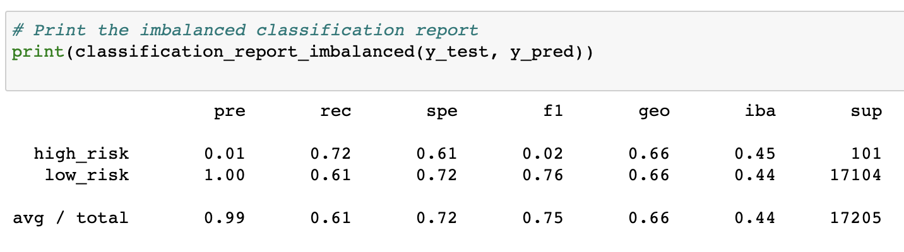
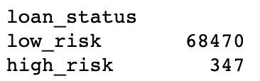

# Credit Risk: Supervised Machine Learning
A classwork example in which models to predict credit risk are assessed using machine learning techniques like imbalanced-learn, SMOTE, and SMOTEEN. 

---
# Overview
"LendingClub: a peer-to-peer lending services company" is requesting that we analyze their credit-risk dataset using 4 different machine learning models. These models will be used to make predictions about credit-risk based on patterns present within the dataset. Credit risk is an inherently unbalanced classification problem, as good loans easily outnumber risky loans. This means we would need to apply more weight towards good loans, predicting that good loans should always outnumber the amount of risky loans in a model. In statistics and data analysis, this is otherwise known as class imbalance - a situation where the existing classes in a dataset aren't equally represented. 

## Purpose
Machine learning models with unbalanced classes will be evaluated to determine which model works best for this given data set. We will test:
* Oversampling using RandomOverSampler and SMOTE (Synthetic Minority Oversampling Technique)
* Undersampling with ClusterCentroids
* Combination Sampling with SMOTEENN (Synthetic Minority Oversampling Technique + Edited NearestNeighbors)
* Ensemble classifiers to reduce bias with BalancedRandomForestClassifier and EasyEnsembleClassifier

*These models are from Python libraries scikit-learn(sklearn) and imbalanced-learn*

---

# Results
## Oversampling
If one class has too few instances in a training set, we can choose more observations from that class for training purposes. 

### RandomOverSampler
#### Balanced Accuracy Score

* The balanced accuracy score is the percentage of predictions that are correct. This is a comparison of the original dataset that was set aside for testing and the models predictions that were correct. RandomOverSampler was only accurate 65% of the time. 

#### Confusion Matrix

The confusion matrix shows the amount of "True Positives" (top left cell), "False Positives" (bottom left cell), "False Negatives" (top right cell), and "True Negatives" (bottom right cell). 

#### Imbalanced Classification Report

* Precision (pre) is the measure of how reliable a positive classification is. Since precision is so high for low_risk and so low for high_risk, RandomOverSampler is not as precise as can be even though the overall score is quite high. Precision comes to be 0.99 or 99%.
* Recall (rec) is the ability of the classifier to find all the positive samples. Recall (also known as sensitivity) is quite low for high_risk and low_risk, which indicated that there is a considerate amount of false negative values meaning the model was often incorrect. Recall comes to be 0.59 or 59%.
* F1 Score (f1) is a weighted average of the recall and precision values. Since recall and precision were both less than ideal, F1 comes to be 0.73 or 73%.
* Geometric mean and index balanced accuracy will not be evaluated in this project.

### SMOTE
This is an alternate oversampling approach to increase the size of the minority class for training purposes. New (synthetic) observation instances are generated to add values to the minority class. This is also known as interpolation.

#### Balanced Accuracy Score

#### Confusion Matrix

The confusion matrix shows the amount of "True Positives" (top left cell), "False Positives" (bottom left cell), "False Negatives" (top right cell), and "True Negatives" (bottom right cell). 

#### Imbalanced Classification Report

* Geometric mean and index balanced accuracy will not be evaluated in this project.

## Undersampling
If one class has too few instances in a training set, we can randomly select observations from that class until the majority and minority classes are balanced for training purposes. 

### ClusterCentroids
#### Balanced Accuracy Score

#### Confusion Matrix

The confusion matrix shows the amount of "True Positives" (top left cell), "False Positives" (bottom left cell), "False Negatives" (top right cell), and "True Negatives" (bottom right cell). 

#### Imbalanced Classification Report

* Geometric mean and index balanced accuracy will not be evaluated in this project.

## Combination of Over and Undersampling
### SMOTEENN
#### Balanced Accuracy Score

#### Confusion Matrix

The confusion matrix shows the amount of "True Positives" (top left cell), "False Positives" (bottom left cell), "False Negatives" (top right cell), and "True Negatives" (bottom right cell). 

#### Imbalanced Classification Report

* Geometric mean and index balanced accuracy will not be evaluated in this project.

## Ensemble classifiers
### BalancedRandomForestClassifier
#### Balanced Accuracy Score

#### Confusion Matrix

The confusion matrix shows the amount of "True Positives" (top left cell), "False Positives" (bottom left cell), "False Negatives" (top right cell), and "True Negatives" (bottom right cell). 

#### Imbalanced Classification Report

* Geometric mean and index balanced accuracy will not be evaluated in this project.

### EasyEnsembleClassifier
#### Balanced Accuracy Score

#### Confusion Matrix

The confusion matrix shows the amount of "True Positives" (top left cell), "False Positives" (bottom left cell), "False Negatives" (top right cell), and "True Negatives" (bottom right cell). 

#### Imbalanced Classification Report

* Geometric mean and index balanced accuracy will not be evaluated in this project.

# Summary 
This is where the summary will go

---

It is to be noted that machine learning models may not be as robust as real-life instances due to only taking a small set of data compared to the large size of the original dataset. Close to 99% of the applications in the original dataset (before the sample or training was taken) were classified as "low risk". This disparity between the actual dataset and real-life instances should require further analysis.
This is the total of each classification before the data was sampled or trained:

