# Credit Risk: Supervised Machine Learning
A classwork example in which models to predict credit risk are assessed using machine learning techniques like imbalanced-learn, SMOTE, and SMOTEEN. 

---
# Overview
"LendingClub: a peer-to-peer lending services company" is requesting that we analyze their credit-risk dataset using 4 different machine learning models. These models will be used to make predictions about credit-risk based on patterns present within the dataset. Credit risk is an inherently unbalanced classification problem, as good loans easily outnumber risky loans. This means we would need to apply more weight towards good loans, predicting that good loans should always outnumber the amount of risky loans in a model. 

## Purpose
Machine learning models with unbalanced classes will be evaluated to determine which model works best for this given data set. We will test:
* Oversampling using RandomOverSampler and SMOTE (Synthetic Minority Oversampling Technique)
* Undersampling with ClusterCentroids
* Combination Sampling with SMOTEENN (Synthetic Minority Oversampling Technique + Edited NearestNeighbors)
* Ensemble classifiers to reduce bias with BalancedRandomForestClassifier and EasyEnsembleClassifier

*These models are from Python libraries scikit-learn(sklearn) and imbalanced-learn*

---

# Results
## Oversampling
### RandomOverSampler
#### Balanced Accuracy Score
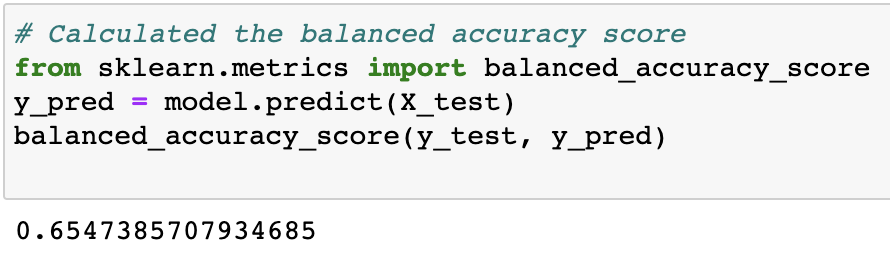

#### Confusion Matrix
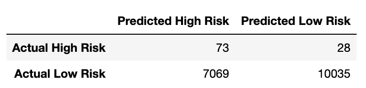

#### Imbalanced Classification Report

### SMOTE
#### Balanced Accuracy Score
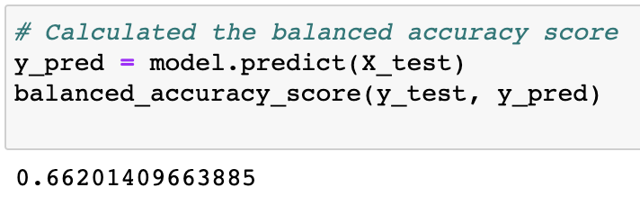

#### Confusion Matrix
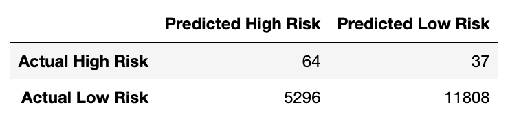

#### Imbalanced Classification Report
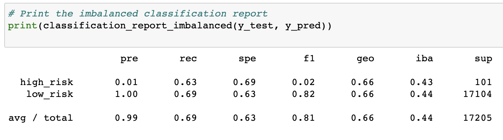

## Undersampling
### ClusterCentroids
#### Balanced Accuracy Score
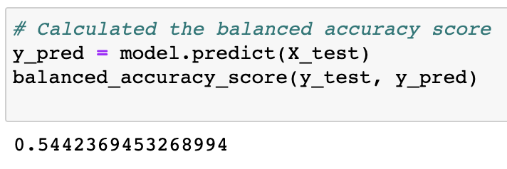

#### Confusion Matrix
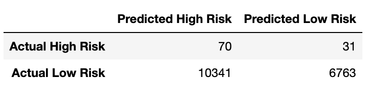

#### Imbalanced Classification Report
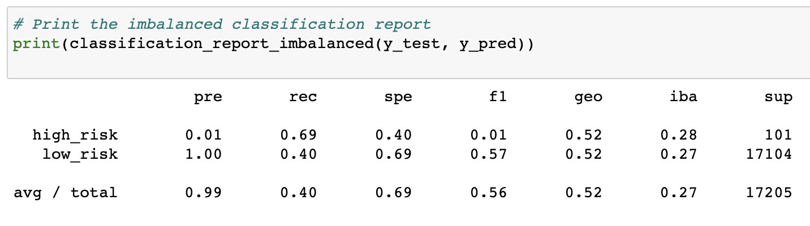

## Combination of Over and Undersampling
### SMOTEENN
#### Balanced Accuracy Score
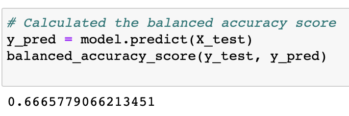

#### Confusion Matrix

#### Imbalanced Classification Report

## Ensemble classifiers
### BalancedRandomForestClassifier
#### Balanced Accuracy Score
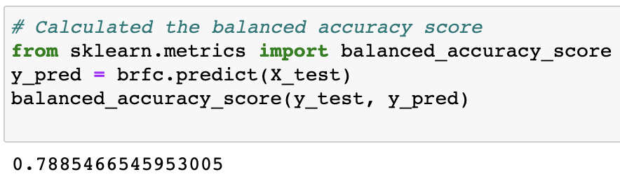

#### Confusion Matrix
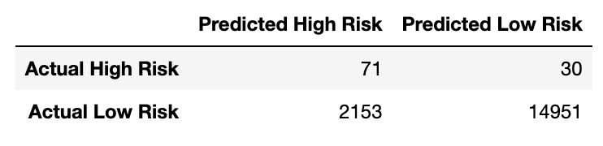

#### Imbalanced Classification Report
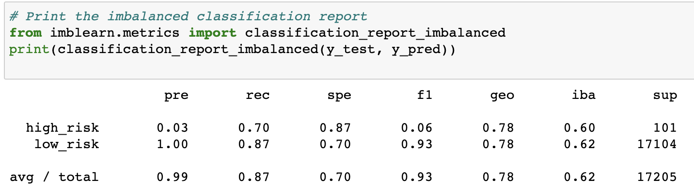

### EasyEnsembleClassifier
#### Balanced Accuracy Score
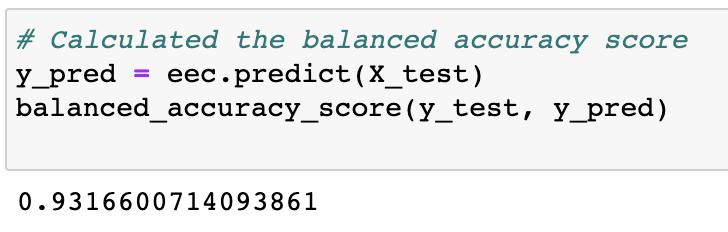

#### Confusion Matrix
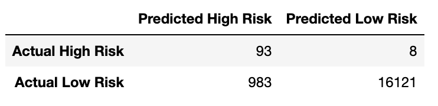

#### Imbalanced Classification Report
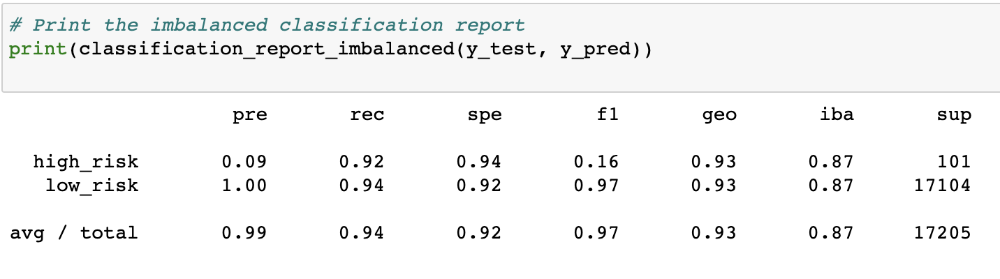

# Summary 
This is where the summary will go

---

It is to be noted that machine learning models may not be as robust as real-life instances due to only taking a small set of data compared to the large size of the original dataset. Close to 99% of the applications in the original dataset (before the sample or training was taken) were classified as "low risk". This disparity between the actual dataset and real-life instances should require further analysis.
